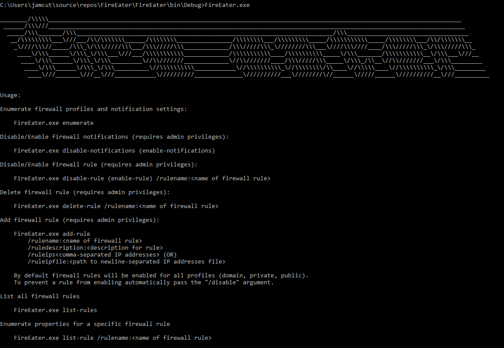

# FireEater
C# tool to interact with Windows firewall

## What is this?
FireEater allows a user to interact with the Windows firewall through .NET APIs.  This is beneficial from a red team perspective as there are no calls to `netsh` which maybe logged and alerted on.  The best use case with the current functionality is blocking outbound traffic to specific IP addresses (AV, EDR, etc.)

## Gotchas
* All of the commands that modify (create, delete, enable, disable, etc.) require administrator permissions on the target endpoint.
* This makes use of the "Windows Firewall with Advanced Security" API, so it will not work on systems < Windows 7 / Server 2008.

## Build
Open the solution file in Visual Studio and build the project.

## Usage

## Thanks
Thanks to [harmj0y](https://twitter.com/harmj0y) for his implementation of subcommands and argument parsing used in [Rubeus](https://github.com/GhostPack/Rubeus).  I copied that, nearly verbatim, for FireEater.  I am not sure if he came up with it, but his project was the first place I saw it, so I'll give him the credit.
